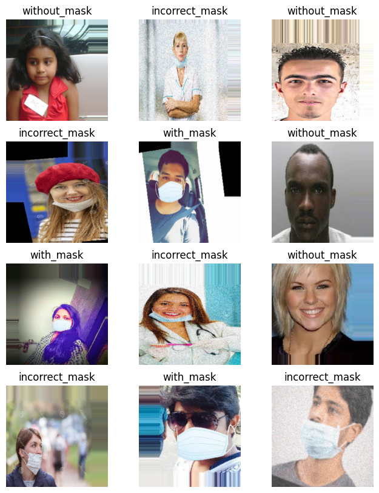
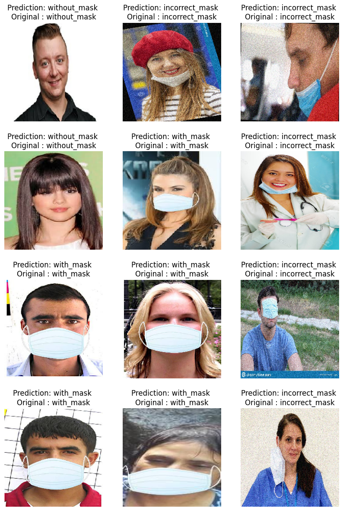

# Face Mask Detection using Convolutional Neural Network (CNN)

## Overview

This project implements a Face Mask Detection model using a custom Convolutional Neural Network (CNN). The model classifies images into three categories:

1. People wearing masks
2. People not wearing masks
3. People wearing masks but in an incorrect manner

The dataset used for training and testing is obtained from Kaggle, specifically the ["Face Mask Detector (mask, not mask, incorrect mask)" dataset].

## Usage

### 1. Installation

To run the notebook locally, follow these steps:

```bash
# Clone the repository
git clone https://github.com/your-username/face-mask-detection.git
cd face-mask-detection

# Install the required dependencies
pip install -r requirements.txt
```
### 2. Dataset
Download the dataset from Kaggle using the Kaggle API key.  Upload your Kaggle API key (kaggle.json) as mentioned in the notebook.

```bash

# Download the dataset using Kaggle API
!kaggle datasets download -d spandanpatnaik09/face-mask-detectormask-not-mask-incorrect-mask

# Unzip the downloaded dataset
!unzip face-mask-detectormask-not-mask-incorrect-mask.zip -d dataset
```
### 3. Training Images
Below are sample images from the training dataset:




### 4. Running the Notebook
Open the Jupyter notebook Face_Mask_Detection.ipynb in your local environment and run the code. Make sure to adjust any paths or configurations if needed.

#### Data Augmentation Parameters
The following data augmentation techniques are applied to the training dataset:
 - Rescale: Pixel values are rescaled to the range of [0, 1].
 - Rotation: Random rotation of images by up to 20 degrees.
 - Width Shift: Random horizontal shift of images by up to 20% of the total width.
 - Height Shift: Random vertical shift of images by up to 20% of the total height.
 - Zoom: Random zooming into images by up to 20%.
 - Horizontal Flip: Randomly flip images horizontally.


#### Model Architecture
The Face Mask Detection model is built using TensorFlow and Keras. The CNN model architecture consists of several layers, each serving a specific purpose in the image classification task.
 - Convolutional Layers: Three convolutional layers with 64 filters and a kernel size(2x2).
 - MaxPooling Layers: Three max-pooling layers with a pool size of 2x2.
 - Flatten Layer: Flattens the output from the convolutional layers into a one-dimensional array.
 - Dense Layers: Two dense layers with ReLU activation functions. The first dense layer consist of 128 neurons, providing a high-level representation of the 
   learned features. The second dense layer, with 3 neurons and softmax activation, produces the final probability distribution for the three classes ('with_mask', 
   'without_mask', 'incorrect_mask').
 - Dropout Layer: Introduces dropout regularization with a rate of 0.5 to prevent overfitting during training.

### 5. Results
Below are some predicted label images from the test dataset:



### License
This project is licensed under the MIT License - see the LICENSE file for details.

### Acknowledgments
- Dataset: Face Mask Detector (mask, not mask, incorrect mask)
- TensorFlow and Keras for deep learning tools
